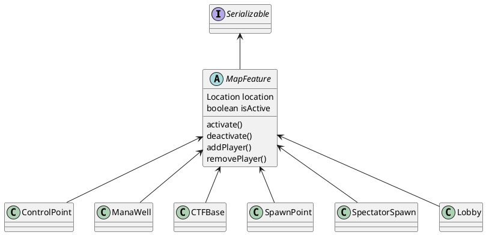
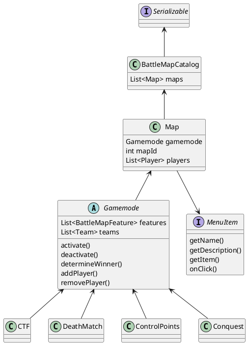

# BattleMap

## Features

## Kits

## GameModes
This plugin supports multiple gamemodes. For each gamemode there can be multiple maps. Each map has to be initialized for a certain gamemode in order for the plugin to know what to do.

## Commands

### Catalog

|base         | path       | arguments                 | description                                            | comment                                  |
|-------------|------------|---------------------------|--------------------------------------------------------|------------------------------------------|
|/catalog     | create     | confirm                   | Replace current catalog with a new catalog.            | -                                        |
| ^           | save       | <fileName\>               | Save current catalog with specified name.              | if name is left empty, use default name. |
| ^           | load       | <fileName\>               | Load specified catalog.                                | if name is left empty, use default name. |
| ^           | delete     | -                         | Delete specified catalog.                              | -                                        |
| ^           | list       | -                         | Display list of available catalogs.                    | -                                        |
|/map         | create     | <mapName\> <gamemode\>    | Create a new map at your location with given gamemode. | mapName must be unique, location is set to current location|
| ^           | delete     | <mapName\>                | Delete the specified map.                              | -                                        |
| ^           | update     | <mapName\> <mapName\>     | Update name of specified map to new name.              | New mapName must be unique               |
| ^           | ^          | <mapName\> <gamemode\>    | Update gamemode of specified map to other gamemode.    | -                                        |
| ^           | ^          | <mapName\> location       | Update location of specified map to current location.  | -                                        |
| ^           | activate   | <mapName\>                | Activate specified map.                                | Cannot activate active map.              |
| ^           | deactivate | <mapName\>                | Deactivate specified map.                              | Cannot deactivate deactivated map.       |
| ^           | list       | -                         | Display list of all maps.                              | -                                        |
| ^           | gamemodes  | -                         | Get a list of available gamemodes                      | -                                        |
| ^           | goto       | <mapName\>                | Tp to specified map.                                   | -                                        |
|/feature     | delete     | <mapName\> <featureName\> | Delete the specified feature in specified map.         | -                                        |
| ^           | list       | <mapName\>                | Display list of features for specified map.            | -                                        |
| ^           | goto       | <mapName\> <featureName\> | Tp to specified feature in a map.                      | -                                        |
|/controlpoint| create     | <mapName\> <featureName\> <captureTime\> <radius\> | Create a new control point    | Some settings are defined by map's gamemode|
