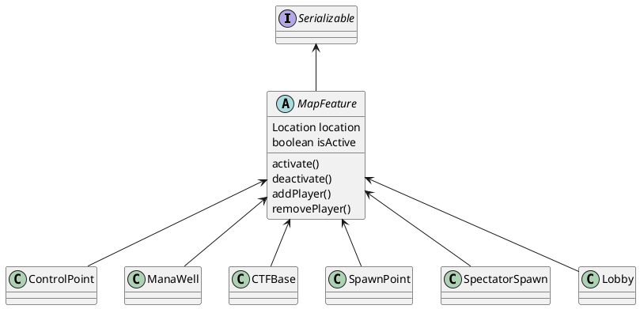
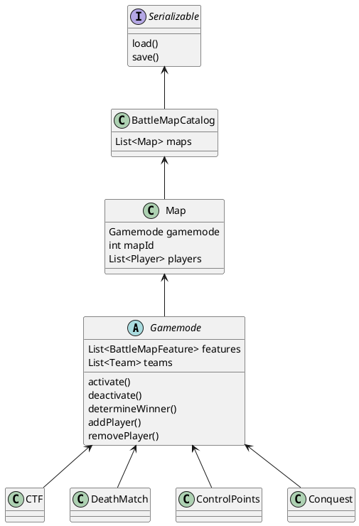

# BattleMap

## Features

## Kits

## GameModes
This plugin supports multiple gamemodes. For each gamemode there can be multiple maps. Each map has to be initialized for a certain gamemode in order for the plugin to know what to do.

## Commands
### /center
### /controlpoint